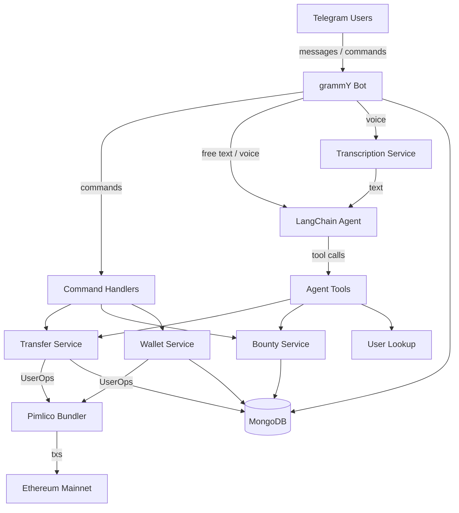

# AA Telegram Bot

Telegram bot code with ERC-4337 smart account wallets, peer-to-peer token transfers, bounty system, and AI-powered natural language interface via LangChain.

> **GitHub description:** Telegram bot with ERC-4337 smart account wallets, peer-to-peer token transfers, bounty system, and AI-powered natural language interface via LangChain.

## Features

- **Smart Account Wallets** — Auto-creates Safe (ERC-4337) smart accounts per user; gas sponsored via Pimlico paymaster.
- **Token Transfers** — Send ERC-20 tokens to any registered user by Telegram username.
- **Admin Funding** — Treasury-funded token distribution restricted to admin.
- **Bounty System** — Create, list, search, claim, confirm/deny, and cancel bounties with on-chain payouts.
- **AI Agent** — Natural language interface (LangChain + OpenRouter) with tool-calling for transfers, bounties, and user lookups.
- **Voice Messages** — Transcribes voice notes via Fireworks Whisper and routes them through the AI agent.
- **Chat History** — Persists all messages to MongoDB; agent uses recent history for context.
- **Notifications** — DMs sender and recipient on transfers and bounty events.

## Architecture



## Tech Stack

| Layer | Technology |
|---|---|
| Bot framework | grammY |
| Blockchain | viem, permissionless (Pimlico), ERC-4337 / Safe v1.5 |
| AI | LangChain, OpenRouter (configurable model) |
| Transcription | Fireworks Whisper v3 Turbo |
| Database | MongoDB via Mongoose |
| Runtime | Node.js, TypeScript (tsx) |

## Project Structure

```
src/
├── index.ts                  # Entry point — bot setup, commands, handlers
├── config.ts                 # Env loading, viem/Pimlico client init
├── agent/
│   ├── index.ts              # LangChain agent orchestration
│   └── tools.ts              # Agent tool definitions
├── db/
│   ├── connection.ts         # MongoDB connection
│   └── models/
│       ├── user.model.ts     # User schema
│       ├── bounty.model.ts   # Bounty schema
│       └── chat-message.model.ts  # Chat message schema
└── services/
    ├── wallet.service.ts     # Smart account creation
    ├── transfer.service.ts   # Token balance / transfer logic
    ├── bounty.service.ts     # Bounty CRUD + payout
    └── transcription.service.ts  # Voice-to-text
scripts/
└── create-owner-safe.ts      # One-off: compute owner Safe address
```

## Function Reference

### `src/config.ts`

| Function | Description |
|---|---|
| `requireEnv(name)` | Returns env var value or throws if missing. |

Exports: `BOT_TOKEN`, `MONGODB_URI`, `TOKEN_CONTRACT_ADDRESS`, `OWNER_PRIVATE_KEY`, `OWNER_SAFE_ADDRESS`, `ADMIN_TELEGRAM_ID`, `BOUNTY_CHAT_ID`, `FIREWORKS_API_KEY`, `OPENROUTER_API_KEY`, `OPENROUTER_MODEL`, `chain`, `publicClient`, `pimlicoUrl`, `pimlicoClient`.

### `src/index.ts`

**Helpers**

| Function | Description |
|---|---|
| `log(command, userId, username, details)` | Timestamped console log for command tracing. |
| `buildDisplayName(from)` | Returns `"First Last"` or `"First"` from Telegram user object. |
| `syncProfile(from)` | Fire-and-forget update of username/displayName in DB. |
| `startTyping(ctx)` | Sends repeating "typing" action; returns `{ stop }` handle. |
| `notifyRecipient(...)` | DMs recipient about an incoming transfer. |
| `notifySender(...)` | DMs sender confirming an outgoing transfer. |
| `notifyBountyCreator(...)` | DMs bounty creator with confirm/deny buttons on a claim. |

**Bot Commands**

| Command | Description |
|---|---|
| `/start` | Creates a new Safe smart account wallet for the user. |
| `/send @user amount` | Transfers tokens from sender to recipient by username. |
| `/fund @user amount` | Admin-only: sends tokens from treasury to a user. |
| `/balance` | Shows the caller's token balance. |
| `/wallet` | Shows the caller's wallet address and deployment status. |
| `/bounty <amount> <desc>` | Creates a new bounty with a token reward. |
| `/bounties [search]` | Lists open bounties, optionally filtered by keyword. |
| `/claim <id>` | Claims a bounty; notifies creator for review. |
| `/cancel_bounty <id>` | Cancels a bounty (creator only). |

**Event Handlers**

| Handler | Description |
|---|---|
| `callback_query:data` | Handles inline-keyboard confirm/deny for bounty claims; triggers payout on confirm. |
| `message:voice` | Downloads voice file, transcribes via Whisper, then routes through AI agent. |
| `message:text` | Routes non-command text messages through the AI agent. |
| Middleware (message logger) | Saves every incoming message to `ChatMessage` collection. |
| API transformer | Upserts bot-sent messages into `ChatMessage` collection. |

**Entry**

| Function | Description |
|---|---|
| `main()` | Connects DB, registers bot commands, starts long-polling. |

### `src/db/connection.ts`

| Function | Description |
|---|---|
| `connectDB()` | Connects Mongoose to the configured MongoDB URI. |

### `src/db/models/`

| Model | Fields |
|---|---|
| **User** | `telegramId`, `username`, `displayName`, `smartAccountAddress`, `privateKey`, `isDeployed`, `createdAt` |
| **Bounty** | `shortId`, `creatorTelegramId`, `description`, `amount`, `status` (open/claimed/completed/cancelled), `claimerTelegramId`, `createdAt`, `completedAt` |
| **ChatMessage** | `chatId`, `messageId`, `senderTelegramId`, `senderUsername`, `senderDisplayName`, `isBot`, `text`, `createdAt` |

### `src/services/wallet.service.ts`

| Function | Description |
|---|---|
| `createWallet()` | Generates a private key, derives a Safe v1.5 smart account. Returns `{ address, privateKey }`. |
| `buildSmartAccountClient(privateKey)` | Builds a `SmartAccountClient` with Pimlico bundler and paymaster for sending UserOperations. |

### `src/services/transfer.service.ts`

| Function | Description |
|---|---|
| `getTokenBalance(address)` | Reads on-chain ERC-20 balance. |
| `getTokenDecimals()` | Reads token decimals from contract. |
| `getTokenSymbol()` | Reads token symbol from contract. |
| `formatBalance(address)` | Returns human-readable balance string (e.g. `"100 $TKN"`). |
| `sendTokens(fromKey, toAddr, amount)` | Builds and submits a UserOperation to transfer tokens. Returns tx hash. |
| `performTransfer(senderId, recipientUsername, amount)` | End-to-end transfer: validates users, checks balance, sends tokens, marks wallet deployed. |

### `src/services/bounty.service.ts`

| Function | Description |
|---|---|
| `generateShortId()` | Creates a random 6-char hex ID for bounties. |
| `createBounty(creatorId, description, amount)` | Inserts a new open bounty with a unique short ID. |
| `listOpenBounties(search?)` | Queries open bounties; optionally filters by description or creator. Enriches with creator profile. |
| `claimBounty(shortId, claimerId)` | Validates and marks a bounty as claimed. Prevents self-claims and duplicate claims. |
| `confirmBounty(shortId)` | Transfers reward from creator to claimer on-chain; marks bounty completed. |
| `denyBounty(shortId)` | Resets bounty to open, clears claimer. |
| `cancelBounty(shortId, telegramId)` | Cancels a bounty (creator only, not if already completed). |

### `src/services/transcription.service.ts`

| Function | Description |
|---|---|
| `transcribeAudio(buffer, mimeType)` | Sends audio to Fireworks Whisper API, returns transcribed text. |

### `src/agent/index.ts`

| Function | Description |
|---|---|
| `loadChatHistory(chatId)` | Loads last 15 messages from MongoDB, maps to LangChain message objects. |
| `invokeAgent(chatId, ctx)` | Builds tools + history, invokes LangChain agent with system prompt, returns AI response text. |

### `src/agent/tools.ts`

| Tool / Function | Description |
|---|---|
| `buildTools(ctx)` | Returns all 6 agent tools bound to the current user context. |
| `get_users` | Searches registered users by ID, username, or display name. |
| `transfer_money` | Transfers tokens from current user to another by username. Notifies both parties. |
| `create_bounty` | Creates a bounty on behalf of the current user and posts it to the bounty chat. |
| `list_bounties` | Lists open bounties with optional search filter. |
| `claim_bounty` | Claims a bounty for the current user; notifies the creator with confirm/deny buttons. |
| `cancel_bounty` | Cancels a bounty owned by the current user. |

**Type Exports:** `ToolContext`, `NotifyRecipientFn`, `NotifySenderFn`, `NotifyBountyClaimFn`, `PostBountyFn`.

### `scripts/create-owner-safe.ts`

Standalone script that computes the counterfactual Safe address for the owner private key. Run once during setup to get `OWNER_SAFE_ADDRESS`.

## Environment Variables

| Variable | Required | Description |
|---|---|---|
| `BOT_TOKEN` | Yes | Telegram bot token |
| `MONGODB_URI` | Yes | MongoDB connection string |
| `TOKEN_CONTRACT_ADDRESS` | Yes | ERC-20 token contract address |
| `OWNER_PRIVATE_KEY` | Yes | Private key for the treasury/owner wallet |
| `OWNER_SAFE_ADDRESS` | Yes | Counterfactual Safe address for the owner |
| `PIMLICO_API_KEY` | Yes | Pimlico bundler/paymaster API key |
| `RPC_URL` | Yes | Ethereum JSON-RPC endpoint |
| `FIREWORKS_API_KEY` | Yes | Fireworks API key for Whisper transcription |
| `OPENROUTER_API_KEY` | Yes | OpenRouter API key for LLM |
| `OPENROUTER_MODEL` | No | LLM model identifier (default: `anthropic/claude-sonnet-4`) |
| `ADMIN_TELEGRAM_ID` | No | Telegram user ID allowed to use `/fund` |
| `BOUNTY_CHAT_ID` | No | Chat ID where new bounties are cross-posted |

## Usage

```bash
pnpm install
pnpm start       # production
pnpm dev         # watch mode (auto-restart on changes)
```

Compute the owner Safe address (one-time setup):

```bash
npx tsx scripts/create-owner-safe.ts
```
